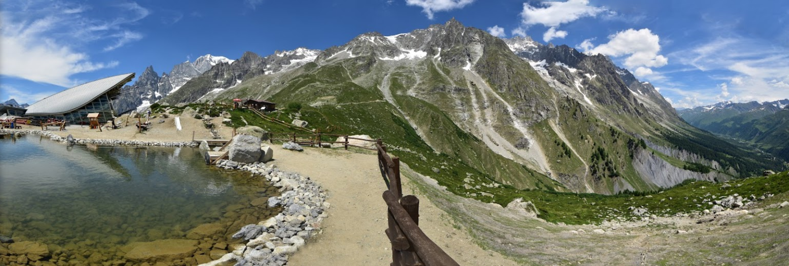

Calling All Bush Pilots!

We need pilots with mountain and bush flying experience to ferry University students conducting various geological experiments in the glacial valleys of Mount Blanc. The students will also be practicing their skills of aerial survey and orientation, the students will be identifying landmarks from the air and conduct scouting runs to mark areas of geological interest.

The University of Colorado, USA and University of Padova, Italy are teaming up for a geological survey of the area immediately surrounding Mount Blanc. The American and Italian passengers will need to be picked up in Turin, Italy, and flown to various destinations in the mountains to conduct scientific surveys. The students will also be practicing the skill of aerial survey by identifying landmakrs from the air and conducting scouting runs to mark areas of geological interest. about the topography and orientation via a Scavenger Hunt, and will capture soil and vegetation contrast lines on the ground to identify fault lineaments. Finally, the University staff are treating the pilots and students to a skiing trip in Aosta and dinner in Megeve.

Figure 1

Figure 1

Figure 1

Figure 1

Figure 1

Figure 1

Figure 1

Figure 1

Figure 1

Figure 1

Figure 1

Figure 1

We are seeking bush pilots experienced in mountain flying and navigation to take several clients up to

We have several clients who are participating in a Scavenger Hunt 

# Flight Planning

Pilots are allowed to fly via VFR but should expect some incident encounters of IMC due to the elevation and mountainous terrain.

## Safety Briefing

Icing may be encountered at or around 1-0 10,000 ft ASL. In the event of icing or IMC pilots should immediately verbally state intentions, and descend and land at any nearby airport, airstrip, field, or roadway until conditions subside.

## ATIS / Weather:
0745 Local Time

Scattered clouds bottoms 10000 tops 12000

Scattered clouds bottoms 20000 tops 25000 

Winds 270 at 10 5,000

## Pre-Departure:

Depart From Turino Airport (LIMA)

Runway Orientation: 10L/28R

Tune NAV radio to AOSTA: 109.25 (secondary)

Tune NAV radio to TORINA CASELLE: 116.75 (primary)

## Departure:
Lineup for and hold short runway 28R.

### VFR | VOR Instructions

**If VFR:**

Upon departure, turn left heading 300

**If VOR:**

Upon departure,

Make left traffic to LIMF VOR (116.75)

Fly from LIMF VOR (116.75) @ HDG 300. Maintain VFR.

Intercept LIMW @ 200 & maintain VFR to LIMW

## Flight Plan

VFR is approved. However, pilots should expect some incidental IMC

LIMA > LIMO > LINS > LIMW 

LIMW > ROCCA > LFHM
