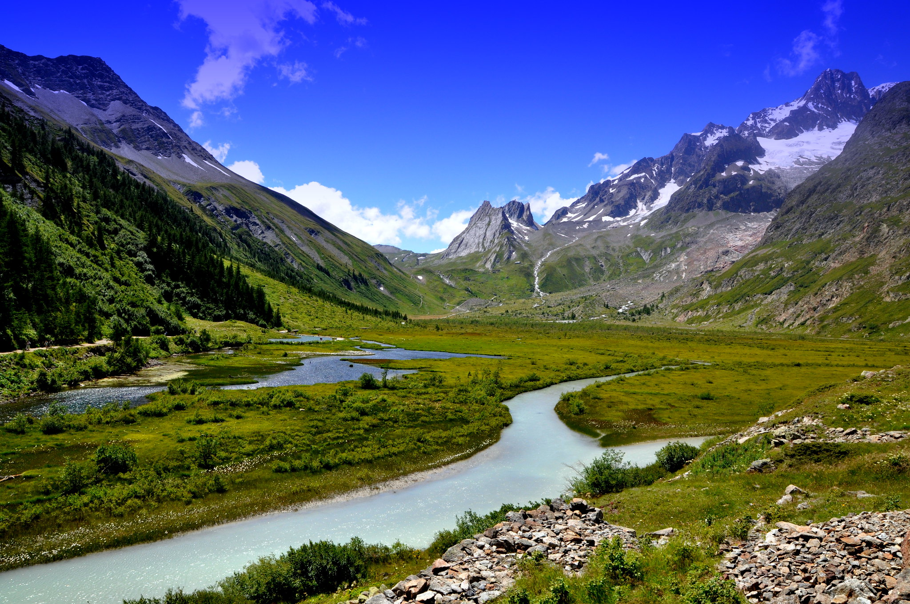
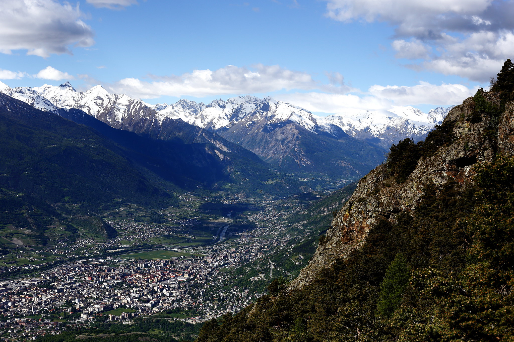
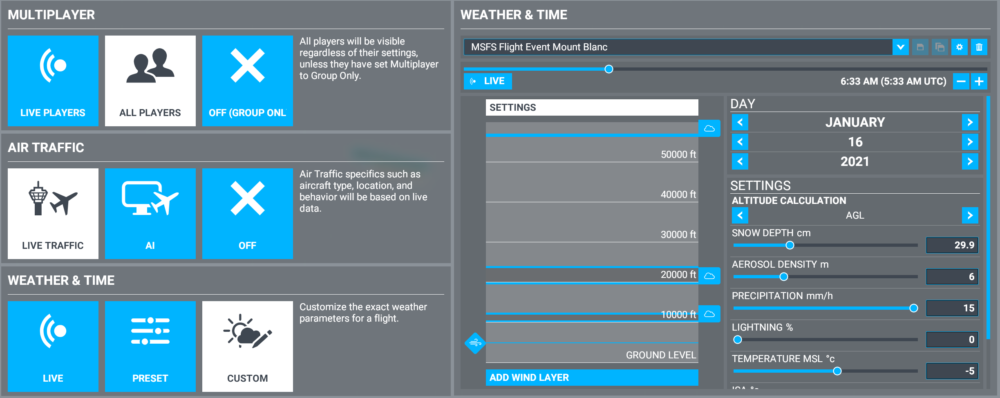
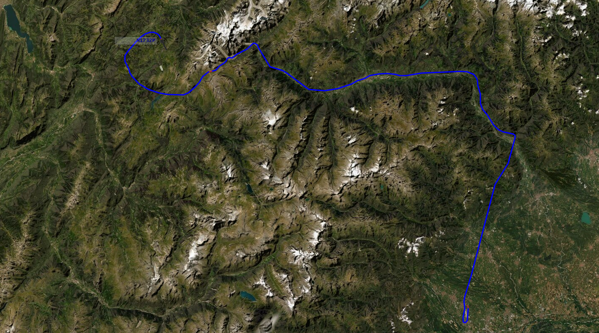
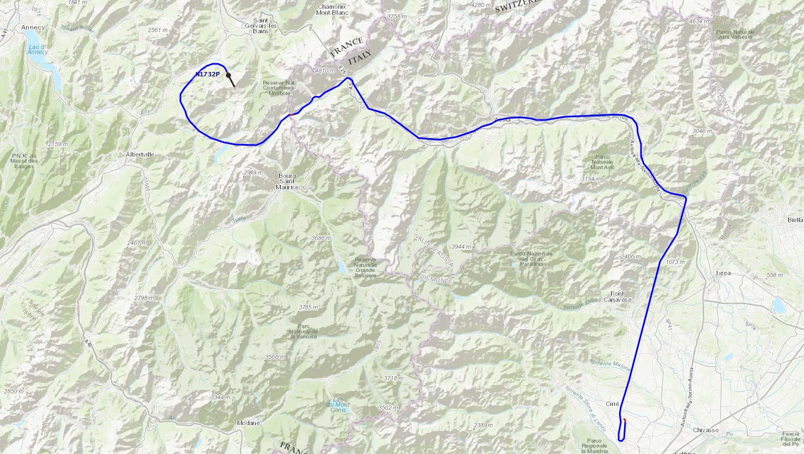
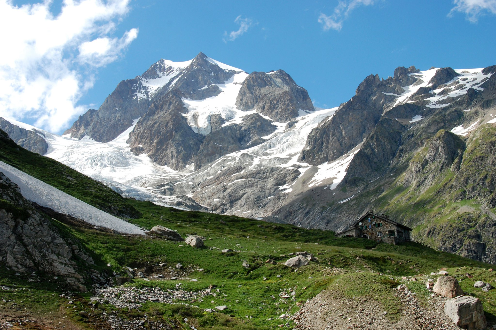
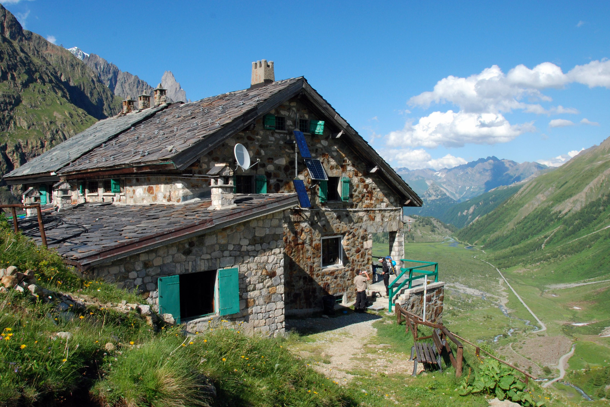

# Calling Pilots with Mountain Flying Experience!  A bush flight and scavenger hunt is scheduled for Saturday January 16

We are seeking pilots with mountain and bush flying experience to ferry University students conducting various geological surveys around the glacial valleys of Mount Blanc. Pilots are authorized to fly VFR. Incident encounters of IMC due to the cloud layer, mountainous terrain, and some potential for icing may occur.

The University of Colorado, USA and University of Padova, Italy are teaming up for a geologic survey of the area immediately surrounding Mount Blanc. The American and Italian passengers will need to be picked up in Turin, Italy, and flown to various destinations in the mountains to capture soil and vegetation contrast lines on the ground, identify fault lineaments, and practice aerial orientation and identification of landmarks. Finally, the University staff are treating the pilots and students to a skiing trip and dinner in Megeve, France.

# Event Details

Theme: Mountain bush flying with aerial scavenger hunt

Date: Saturday, January 16th, 2020

Time: 11 AM PST, 2 PM EST, 7 PM UTC (subject to change)

Server: US East

Event Duration: 60-90 minutes

Discord: https://discord.gg/GRYwahVZPk

Settings: All Players, Custom Weather

Weather: 0730 Local Time Scattered cloud bottoms 10000 tops 12000 Scattered cloud bottoms 20000 tops 25000 Winds 270 10 at 5,000 (image below under ATIS).

 Alternatively you can download the weather settings below:

[Weather settings](https://www.dropbox.com/s/uafipamkt8e6t9c/MSFSFlightEventMountBlanc.WPR?dl=0) - Download this file and save to this location on your desktop:

        C:\Users\<YOUR-USERNAME>\AppData\Local\Packages\Microsoft.FlightSimulator_8wekyb3d8bbwe\LocalState\Weather\Presets

Aircraft: Single engine standard propeller. Inquire event coordinator for exceptions.

# Flight Planning

Destination Turin Airport (LIMA) Elevation: 989' MSL 10L/28R

Enroute Aosta Airport (LIMW) Elevation: 1796' MSL 09/27

Arrival Megev (LFHM) Elevation: 4830' MSL 15/33

## Flight Plan

LIMA > LIMO > LINS > LIMW > ROCCA > LFHM

Disclaimer: These waypoints are to be used as aids *only*. Maintain VFR at all times.

## Route Briefing

The area immediately around the LIMA airport is a relatively flat 3 - 3,000'. Twenty miles West and North of the airport are ridges at about 5 - 5,000' and peaks up to 15 - 15,000'.

The valley into Aosta remains at about 3 - 3,000'. However, the saddle between Aosta and Megeve (SW of Mount Blanc) is about 7 - 7,000'. Pilots will need to climb to and maintain approximately 8,000' to safely clear the saddle while also remaining below clouds.

Above is a topographic map of the route. Departure airport LIMA is to the bottom right, the enroute airport LIMW is the top center, and the arrival airport LFHM is top left. Especially note the terrain elevation between the midway airport, Aosta, and the arrival airport, Megev. Also, note the VOR radio locations and frequencies in the event of GPS equipment failure or IMC.

We plan to depart Turin heading N-NE, turn into the valley toward Aosta following the river, follow the river-valley W until it reaches Mount Blanc, turn left and climb heading SW until we're out of the mountain range. Finally, we land at Megev.

## Safety Briefing

Icing may be encountered at or around 1-0 10,000 ft ASL. In the event of icing or IMC pilots should immediately verbally state intentions, and descend and land at any nearby airport, airstrip, field, or roadway until conditions subside. Each plane will be transporting passengers and equipment and should plan for appropriate fuel and weight.

Flight should last approximately 1 hour. There are multiple airports with refueling en route. Recommend 2 hours of fuel.

## ATIS / Weather:
0730 Local Time, Scattered cloud bottoms 10000 tops 12000, Winds 270 10 at 5,000

## Pre-Departure:

Departure airport: Turino Airport (LIMA)

Tune NAV radio to AOSTA: 109.25 (secondary)

Tune NAV radio to TORINA CASELLE: 116.75 (primary)

## Departure:
Lineup for and hold short runway 28R. When cleared, upon takeoff climb and maintain 4 - 4,000' and turn left heading 030.

### If VOR:

    Upon departure, make left traffic then direct to LIMF VOR (116.75)
    Fly from LIMF VOR (116.75) @ HDG 030. Maintain VFR.
    Intercept LIMW @ 300 & navigate HDG 330 to LIMW. Maintain VFR

# Scavenger Hunt

Details to come.

# Aerial Landmarks

Figure 1

Figure 1

Figure 1

Figure 1

Figure 1

Figure 1
